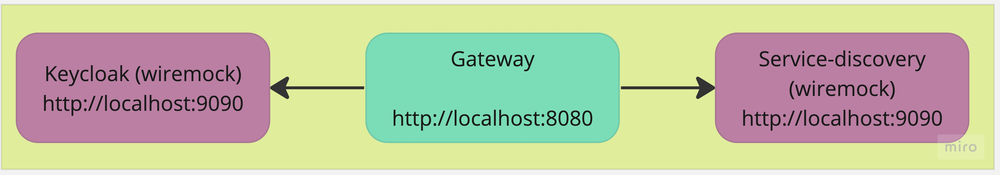

# Gateway
[](https://github.com/groot-mg/gateway/actions/workflows/gateway-ci.yml) [](https://sonarcloud.io/summary/new_code?id=groot-mg_gateway) [](https://github.com/groot-mg/gateway/blob/main/LICENSE)

API Gateway is a tool that provides routing mechanisms to microservices applications as a way of hiding multiple services behind a single facade.

It provides a security layer, and it is the user entry point. All requests coming to the application will go thought the API Gateway.

It provides load balancing across the registered service instances for the same service.

## Build, tests and run

### Build
Build with gradle (build + unit tests):
```
./gradlew build
```

### Functional tests
Run functional-tests:
```
./gradlew cucumber
```

API Gateway depends on `Keycloak` and `Service Discovery`, so wiremock is used to mock those dependencies and test the functionalities of the application.



### Run

<span style="color:red;">It has dependencies and does not run without the dependencies</span>

Dependencies:
* `Keycloak` on port 8180
  * To start the keycloak, go to `identity-service` and check the [wiki](https://github.com/groot-mg/identity-service/wiki/Keycloak#how-to-run)
  * Without Keycloak, the API Gateway fails on start up and does not start
* `Service discovery` on port 8081
  * To start the Service discovery, go to [service-discovery](https://github.com/groot-mg/service-discovery) and start it manually, or go to [docker-local-setup](https://github.com/groot-mg/docker-local-setup) and start it via docker compose
  * Without the Service discovery the application also fails on start up and does not start

Local app is available on the port `8080`, health check endpoint is [http://localhost:8080/private/health](http://localhost:8081/private/health)

```
./gradlew bootRun
 ```

Alternatively, it is possible to run using `java -jar gateway-app/build/libs/gateway.jar`

### Run together with the project

API Gateway should run together with the Service discovery and other services, to run this project, please see [docker-local-setup](https://github.com/groot-mg/docker-local-setup).